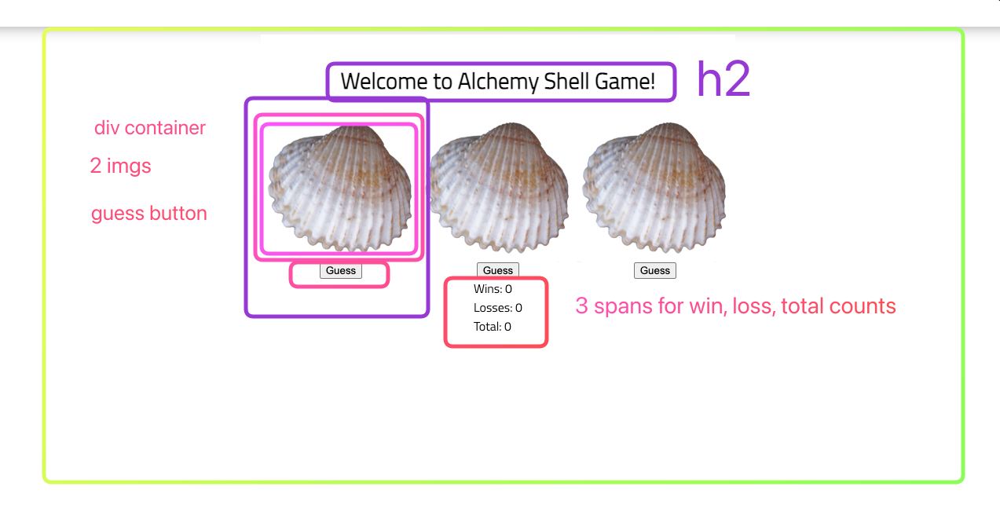

## HTML Setup

-   3 image tags
-   Why? to show the user the correct cup
-   How? `cupImg.src = 'assets/cup-with-ball.png`
-   3 "destination" elements
-   Why? To show the user the wins, losses, and total state as they change
-   How? `winsEl.textContent = winCount`
-   3 buttons
    -   Why? To let the user make a guess
    -   How? `button.addEventListener('click', () => {})`

## State

wins = 0
total = 0

<!-- DERIVED STATE: losses = total - wins -->

## Events -- this is the hard part

-   User clicks one of the buttons
    -   (address the "every shell has a pearl" problem)- reset all shells to closed
    -   increment total
    -   generate a random number between 1 and 3 for pearl placement
    -   grab the shell with corresponding number and add reveal class to it
        -   if correct, increment wins // always increment total on click
    -   update the DOM to show two things:
        -   the correct cup image element should update
        -   the wins, losses, and total elements show update
